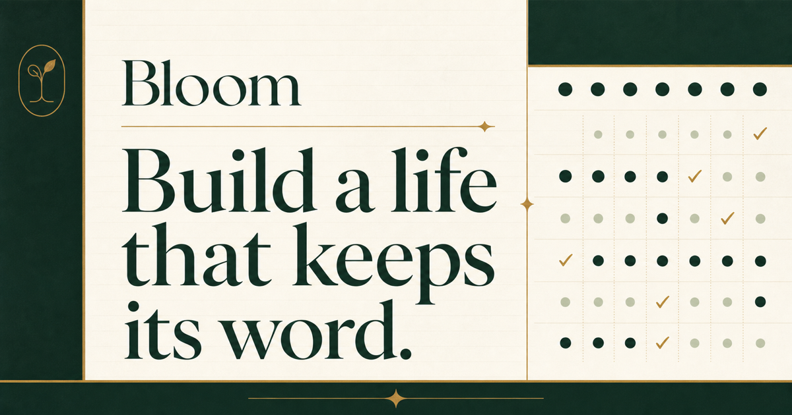

  

# Bloom — Smart Habit Tracker

Bloom is a private, cross-platform habit tracker that helps people build
consistent routines, record honest daily progress, and understand their habits
over time. It includes habit templates, reminders, prayer-aware routines,
progress history, and secure account syncing across web and mobile.

## Main features

- Create custom habits with flexible targets and schedules.
- Record complete, partial, skipped, and missed check-ins.
- Review progress, streaks, history, and downloadable reports.
- Receive habit and prayer reminders through an in-app inbox and push
  notifications.
- Continue tracking offline in the mobile app and sync when connectivity
  returns.
- Keep personal data protected with first-party authentication and secure
  sessions.

## Author

Built by [Sohan Talukder](https://github.com/sohantalukder).
